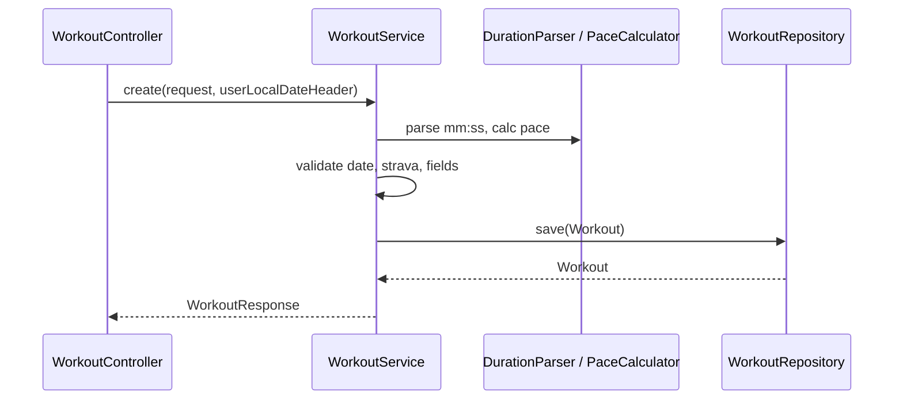

# MVP Workouts v1 — Arquitetura e tasks

**Refs:** US-001, US-002  
**API base:** `/v1/workouts`

---

## Arquitetura

Camadas clássicas Spring, pacote base `com.runningTracker`:

```
com.runningTracker
├── api
│   ├── WorkoutController.java
│   ├── advice
│   │   └── ApiExceptionHandler.java
│   └── dto
│       ├── CreateWorkoutRequest.java
│       ├── WorkoutResponse.java
│       └── PagedWorkoutsResponse.java
├── domain
│   └── Workout.java                    # entidade JPA
├── repository
│   └── WorkoutRepository.java          # JpaRepository
├── service
│   ├── WorkoutService.java
│   ├── PaceCalculator.java
│   ├── DurationParser.java
│   ├── StravaUrlValidator.java
│   └── UserLocalDateResolver.java      # header X-User-Local-Date
└── exception
    ├── WorkoutNotFoundException.java
    └── BusinessValidationException.java
```

### Fluxo (criação)



### Persistência

| Coluna | Tipo | Notas |
|--------|------|--------|
| `id` | `BIGINT` PK | identity |
| `title` | `VARCHAR(120)` | not null |
| `workout_date` | `DATE` | dia civil |
| `distance_km` | `DECIMAL(19,4)` | > 0 |
| `duration_seconds` | `INT` | > 0 |
| `strava_url` | `VARCHAR(2048)` | nullable |
| `pace_min_per_km` | `DECIMAL(10,2)` | calculado, not null |

Índice sugerido: `workout_date DESC, id DESC` (suporta listagem padrão).

### Dependências (Gradle)

Adicionar ao `build.gradle`:

- `spring-boot-starter-data-jpa`
- `spring-boot-starter-validation`

Testes: manter `spring-boot-starter-webmvc-test`; usar H2 em perfil `test`.

### Configuração

| Perfil | Banco | `ddl-auto` |
|--------|-------|------------|
| default / dev | H2 ou Postgres (compose) | `update` |
| test | H2 in-memory | `create-drop` |

`application-test.properties`: datasource H2, desabilitar Docker Compose no teste.

### Contratos transversais

**Header opcional:** `X-User-Local-Date: YYYY-MM-DD`  
- Válido → referência para RN-004 (data futura).  
- Inválido → **`400`** com mensagem clara (decisão Tech Lead; não ignorar silenciosamente).

**Erros `400`:**

```json
{
  "status": 400,
  "message": "Validation failed",
  "errors": [
    { "field": "duration", "message": "Invalid mm:ss format" }
  ]
}
```

**Erro `404`:** `{ "status": 404, "message": "Workout not found" }`

**Paginação:** mapear `Page<Workout>` → envelope do produto (`content`, `page`, `size`, `totalElements`, `totalPages`).

**Sort permitido na v1:** apenas `workoutDate` (direção `asc`/`desc`). Default: `workoutDate,desc`. Sort inválido → `400`.

**`size`:** default 20, máximo 100; `size > 100` ou `size < 1` ou `page < 0` → `400`.

### Componentes de domínio (sem overengineering)

| Componente | Responsabilidade |
|------------|------------------|
| `DurationParser` | `mm:ss` ↔ segundos; regex `^(\d{1,3}):([0-5]\d)$` |
| `PaceCalculator` | `(seconds / 60) / distanceKm` → `BigDecimal` scale 2 HALF_UP |
| `StravaUrlValidator` | URI válida + host `strava.com` / `www.strava.com` |
| `UserLocalDateResolver` | Parse do header ou `LocalDate.now()` |
| `WorkoutMapper` | Entity ↔ `WorkoutResponse` (inclui formatar `duration` mm:ss na saída) |

---

## Tasks técnicas

Ordem sugerida para o Developer Agent (TDD: teste → implementação → refactor).

### TASK-001 — Dependências e configuração JPA

- Adicionar `spring-boot-starter-data-jpa` e `spring-boot-starter-validation`.
- Configurar `application.properties` (JPA naming strategy, show-sql opcional em dev).
- Criar `application-test.properties` com H2 e `ddl-auto=create-drop`.
- **Teste:** contexto sobe em `@SpringBootTest` (smoke).

**DoD:** `./gradlew test` verde.

---

### TASK-002 — Entidade `Workout` e repository

- Criar `domain/Workout.java` com mapeamento JPA e constraints alinhadas à tabela.
- Criar `repository/WorkoutRepository extends JpaRepository<Workout, Long>`.
- **Testes:** `@DataJpaTest` — persistir e carregar entidade; constraint básica se aplicável.

**DoD:** repositório salva e busca por id.

---

### TASK-003 — `DurationParser` e `PaceCalculator`

- Implementar parser `mm:ss` → segundos e formatter segundos → `mm:ss`.
- Implementar cálculo de pace (2 decimais).
- **Testes unitários puros** (sem Spring): casos `53:00` + 10.5 km → 5.05; inválidos `0:00`, `5:60`, `abc`.

**DoD:** cobertura dos edge cases da US-001.

---

### TASK-004 — `StravaUrlValidator` e `UserLocalDateResolver`

- Validar host Strava e URL malformada.
- Resolver data de referência: header válido ou fallback servidor; header malformado → exceção de validação.
- **Testes unitários:** hosts permitidos/proibidos; header presente/ausente/inválido.

**DoD:** regras RN-004 e RN-005 cobertas em unit tests.

---

### TASK-005 — DTOs e validação Bean Validation

- `CreateWorkoutRequest` (title, workoutDate, distanceKm, duration, stravaUrl opcional).
- Anotações: `@NotBlank`, `@Positive`, `@PastOrPresent` **não** usar para data (regra custom no service).
- `WorkoutResponse`, `PagedWorkoutsResponse`, `FieldErrorResponse`.
- **Testes:** validação de campos nulos/vazios no request (unit ou WebMvc slice).

**DoD:** contrato JSON alinhado ao doc de produto.

---

### TASK-006 — `WorkoutService` (criar e buscar por id)

- `create(CreateWorkoutRequest, Optional<String> userLocalDateHeader)`:
  - validar data futura (RN-004);
  - parse duration; calc pace;
  - validar Strava;
  - persistir.
- `findById(Long)` → orElseThrow `WorkoutNotFoundException`.
- `@Transactional` na escrita.
- **Testes:** `@ExtendWith(Mockito)` ou teste de integração com `@DataJpaTest` + service real.

**DoD:** RN-001 a RN-006 atendidas no serviço.

---

### TASK-007 — `WorkoutService.list` (paginação)

- `list(int page, int size, String sort)` com validação de parâmetros (RN-101–103).
- `Pageable` com sort estável (`workoutDate` + `id` desc).
- **Testes:** página vazia, ordenação, `size` > 100 → erro.

**DoD:** US-002 atendida no serviço.

---

### TASK-008 — `WorkoutController` + `ApiExceptionHandler`

- `POST /v1/workouts` → 201 + `Location` opcional.
- `GET /v1/workouts/{id}` → 200/404.
- `GET /v1/workouts` → 200 paginado.
- Ler header `X-User-Local-Date`.
- `@ControllerAdvice` para 400/404 padronizados.
- **Testes:** `@WebMvcTest(WorkoutController.class)` — happy path e erros principais por endpoint.

**DoD:** contratos HTTP da US-001 e US-002.

---

### TASK-009 — Testes de integração end-to-end

- `@SpringBootTest` + `MockMvc` ou `TestRestTemplate`:
  - fluxo POST → GET by id → GET list contém item.
- **DoD:** pipeline mínimo do MVP verde; meta projeto ≥ 90% cobertura nas classes novas (ajustar Jacoco se necessário em task futura).

---

## Mapa tasks × US

| Task | US-001 | US-002 |
|------|--------|--------|
| 001–005 | ✓ | |
| 006 | ✓ | |
| 007 | | ✓ |
| 008 | ✓ | ✓ |
| 009 | ✓ | ✓ |

---

## Riscos

| Risco | Impacto | Mitigação |
|-------|---------|-----------|
| Data civil sem timezone explícito | Validação de “futuro” incorreta para usuários longe do TZ do servidor | Header `X-User-Local-Date`; documentar fallback; evoluir para TZ explícito em v2 |
| `BigDecimal` vs `double` em km/pace | Perda de precisão | Usar `BigDecimal` em entity e cálculo |
| Paginação com sort arbitrário | Injection / erro em query | Whitelist de propriedades (`workoutDate` apenas) |
| `ddl-auto=update` em dev | Drift de schema | Aceitável no MVP; migrar para Flyway antes de produção |
| Sem autenticação | Qualquer cliente grava treinos | Aceito no MVP; auth em épico futuro |
| Listagem sem filtro | Performance com muitos registros | Paginação obrigatória + índice em `workout_date` |

---

## Definition of Ready (Developer)

- [x] Arquitetura e pacotes definidos
- [x] Tasks ordenadas com critérios de teste
- [x] Contratos e decisões de header/documentação fechados
- [ ] Implementação TASK-001 → TASK-009
